# Google Cloud Datastream: PostgreSQL Replication to BigQuery

## Executive Summary
This repository contains the architecture, configuration scripts, and documentation for establishing a real-time, serverless change data capture (CDC) replication pipeline from an operational Cloud SQL for PostgreSQL database to Google BigQuery using Google Cloud Datastream. This pipeline ensures sub-second replication latency for transactional data, enabling continuous analytics and real-time business intelligence without degrading production database performance.

---

## Architecture Overview

The following diagram illustrates the logical architecture of the replication flow. Change data capture (CDC) events are read continuously from the PostgreSQL replication slot and processed by Datastream, which scales serverlessly to ingest, transform, and write data into Google BigQuery.

<p align="center">
  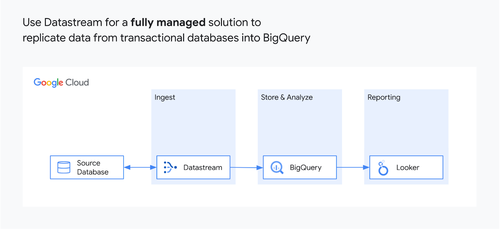
</p>

```
+--------------------------+         +----------------------+         +------------------------+
|  Cloud SQL PostgreSQL   |  (CDC)  |   Google Cloud       |  (ELT)  |     Google BigQuery    |
| (test.example_table)     | ------> |   Datastream Stream  | ------> |  (test.example_table)  |
|  [Replication Slot]      |         |  [Serverless Engine] |         |  [Dataset: test]       |
+--------------------------+         +----------------------+         +------------------------+
```

---

## Business Problem
In modern data-driven enterprises, business analysts and operational systems require access to up-to-the-minute transactional data to make real-time decisions, run dynamic pricing algorithms, or detect fraudulent activities. 

Traditional batch-based ELT/ETL pipelines introduce several issues:
* **High Data Latency:** Data is only updated hourly or daily, leading to stale dashboards and out-of-date analytics.
* **Performance Impact:** Running heavy query sweeps on production OLTP databases degrades the performance of application-facing transactional workloads.
* **Complex Pipeline Overhead:** Designing and maintaining self-hosted CDC agents (such as Debezium or custom Kafka clusters) requires high operational management overhead, patching, and scaling.

---

## Solution Overview
This solution implements a fully serverless, real-time replication pipeline using Google Cloud Datastream. Datastream leverages PostgreSQL logical replication (using replication slots and pgoutput publications) to read the database change log directly. 

This approach addresses the business challenges by:
* **Reducing Latency:** Achieving sub-second replication lag from source database change to BigQuery table availability.
* **Zero Source Impact:** Replicating changes asynchronously from logical logs without scanning transactional tables or locking rows.
* **Serverless Operations:** Operating an auto-scaling, Google-managed service that removes the need for infrastructure management.

---

## Reference Architecture

### Core Google Cloud Services Used

☸️ Cloud SQL for PostgreSQL

Cloud SQL for PostgreSQL is a fully managed relational database service.

It automates database provisioning, storage capacity management, patching, backups, and failover while allowing teams to focus on application development and data modeling instead of database administration.

#### Enterprise Use Cases
* High-performance OLTP transactional applications.
* Operational database source for real-time analytics sync.
* Managed PostgreSQL workloads requiring automated compliance and High Availability (HA).

---

☸️ Google Cloud Datastream

Google Cloud Datastream is a serverless, easy-to-use change data capture (CDC) and replication service.

It replicates data with high throughput and minimal latency from databases (Oracle, MySQL, PostgreSQL, AlloyDB) directly into BigQuery or Cloud Storage while allowing teams to focus on consuming clean, replicated datasets rather than building and managing complex, custom replication pipelines.

#### Enterprise Use Cases
* Low-latency real-time ELT/CDC pipeline replication to BigQuery.
* Database migration with zero or near-zero downtime.
* Real-time synchronization of databases for distributed services.

---

☸️ Google BigQuery

Google BigQuery is a serverless, highly scalable, and cost-effective multi-cloud data warehouse.

It processes massive datasets in seconds using built-in query engines and SQL interfaces while allowing data engineering teams to focus on executing analytics, machine learning, and BI dashboards rather than managing cluster infrastructure.

#### Enterprise Use Cases
* Serverless enterprise data warehousing and analytics.
* Real-time streaming analytics and machine learning modeling.
* Business intelligence dashboarding and ad-hoc query analysis.

---

## Prerequisites
Before implementing this architecture, ensure you have:
1. A **Google Cloud Platform (GCP) Account** with an active project.
2. **Owner** or **Editor** IAM permissions on the GCP project.
3. Access to a **terminal with the Google Cloud CLI (gcloud)** installed and authenticated (e.g., Cloud Shell).
4. Familiarity with standard **Linux environments** and basic **Change Data Capture (CDC)** concepts.

---

## Repository Structure

The following structure outlines the configuration scripts and resources present in this repository:

```
.
├── README.md               # Main enterprise documentation and setup guide
└── images/                 # Local directory containing architectural and verification screenshots
    ├── datastream-api-enabled.png
    ├── postgres-table-creation.png
    ├── postgres-replication-setup.png
    ├── datastream-postgres-profile-test.png
    ├── datastream-postgres-profile-created.png
    ├── datastream-bigquery-profile-created.png
    ├── datastream-connectivity-test.png
    ├── datastream-validation-success.png
    ├── datastream-stream-running.png
    ├── bigquery-initial-data-preview.png
    ├── postgres-mutated-data-execution.png
    ├── bigquery-mutated-data-preview.png
    └── bigquery-query-results.png
```

---

## Environment Variables

To prevent hardcoded identifiers and maintain script modularity, set the following environment variables in your terminal shell before proceeding:

```bash
# Set your active Google Cloud project ID
export PROJECT_ID="YOUR_PROJECT_ID"

# Set the GCP region where resources will be provisioned
export REGION="us-central1"

# Specify the name of the PostgreSQL Cloud SQL instance
export POSTGRES_INSTANCE="postgres-db"

# Set the database administrator root password
export SQL_PASSWORD="pwd"

# Set the Datastream Public IP addresses for your selected region (e.g., us-central1)
# These IPs are used to configure the Cloud SQL authorized networks.
export DATASTREAM_IPS="34.135.210.150,34.135.210.151,34.135.210.152,34.135.210.153,34.135.210.154"
```

> [!NOTE]
> Public IP ranges for Datastream vary by region. Ensure you use the exact IP allowlist corresponding to the region where your Datastream stream is deployed.

---

## Implementation

### Phase 1: API Enablement

To prepare the Google Cloud project environment, enable the Cloud SQL Admin and Datastream APIs.

```bash
# Enable the Cloud SQL Admin API
gcloud services enable sqladmin.googleapis.com --project=$PROJECT_ID

# Enable the Datastream API
gcloud services enable datastream.googleapis.com --project=$PROJECT_ID
```

<p align="center">
  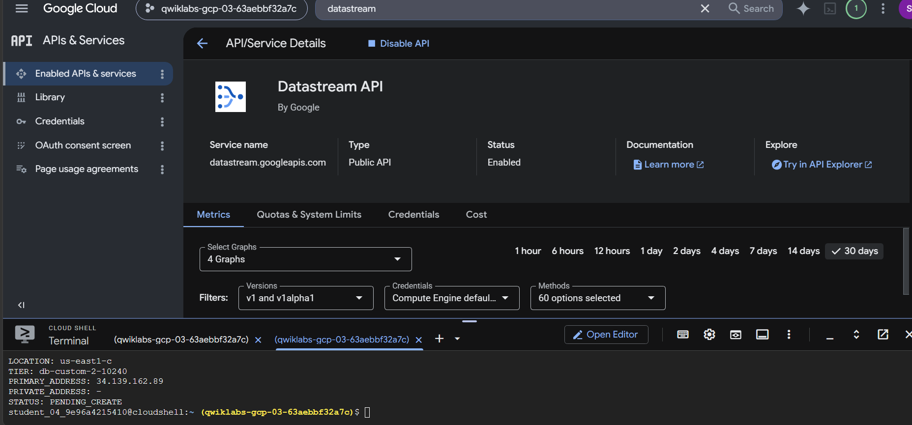
</p>

### Phase 2: Create PostgreSQL Database Instance

Deploy a managed Cloud SQL for PostgreSQL instance with logical decoding enabled. Logical decoding is a prerequisite for change data capture.

```bash
# Provision Cloud SQL for PostgreSQL instance with logical decoding database flag enabled
gcloud sql instances create $POSTGRES_INSTANCE \
    --project=$PROJECT_ID \
    --database-version=POSTGRES_14 \
    --cpu=2 \
    --memory=10GB \
    --authorized-networks=$DATASTREAM_IPS \
    --region=$REGION \
    --root-password=$SQL_PASSWORD \
    --database-flags=cloudsql.logical_decoding=on
```

> [!WARNING]
> Provisioning a Cloud SQL instance typically takes between 3 to 7 minutes to complete. Do not interrupt the operation while the instance is initializing.

### Phase 3: Populate Database Schema and Seed Data

Connect to the PostgreSQL instance using `gcloud sql connect` and seed a sample dataset.

```bash
# Establish an interactive SQL connection to the PostgreSQL database instance
gcloud sql connect $POSTGRES_INSTANCE --user=postgres --project=$PROJECT_ID
```

> [!NOTE]
> Enter the root password (`pwd`) when prompted by the terminal.

Once connected to the PostgreSQL terminal, execute the following SQL script to create a schema and populate the test table:

```sql
-- Create database schema
CREATE SCHEMA IF NOT EXISTS test;

-- Create the target table for replication
CREATE TABLE IF NOT EXISTS test.example_table (
    id SERIAL PRIMARY KEY,
    text_col VARCHAR(50),
    int_col INT,
    date_col TIMESTAMP
);

-- Set Replica Identity to default (records the old values of the primary key columns)
ALTER TABLE test.example_table REPLICA IDENTITY DEFAULT; 

-- Insert initial sample dataset
INSERT INTO test.example_table (text_col, int_col, date_col) VALUES
('hello', 0, '2020-01-01 00:00:00'),
('goodbye', 1, NULL),
('name', -987, NOW()),
('other', 2786, '2021-01-01 00:00:00');
```

<p align="center">
  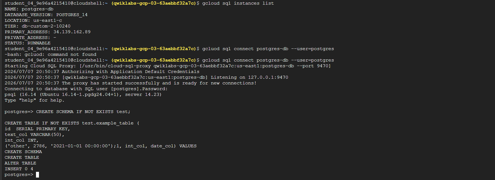
</p>

### Phase 4: Configure PostgreSQL Replication Slot

To support CDC replication, you must configure a logical replication publication and a replication slot inside the source database.

Run the following SQL commands in the database session:

```sql
-- Create publication for replication
CREATE PUBLICATION test_publication FOR ALL TABLES;

-- Grant replication permissions to the postgres user
ALTER USER POSTGRES WITH REPLICATION;

-- Create a logical replication slot using pgoutput plugin
SELECT PG_CREATE_LOGICAL_REPLICATION_SLOT('test_replication', 'pgoutput');
```

<p align="center">
  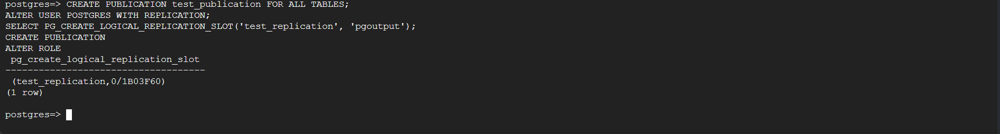
</p>

---

### Phase 5: Create Datastream Connection Profiles

Configure the source and destination endpoints in Datastream using the Google Cloud Console.

#### 1. PostgreSQL Source Connection Profile
* Navigate to **Analytics** > **Datastream** > **Connection Profiles** and click **Create Profile**.
* Select the **PostgreSQL** profile type.
* Set profile name: `postgres-cp`.
* Select Region: `us-central1`.
* Enter Database Connection Details:
  * Host IP: *Retrieve the public IP address of your Cloud SQL instance*.
  * Port: `5432`
  * Username: `postgres`
  * Password: `pwd`
  * Database: `postgres`
* Encryption: **None**.
* Connectivity Method: **IP allowlisting**.
* Click **Run Test** to verify connection, then click **Create**.

<p align="center">
  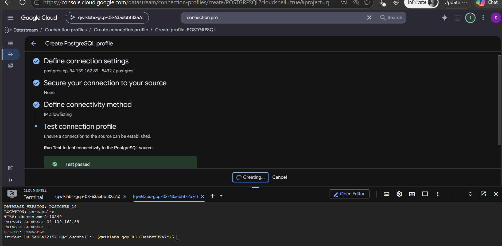
</p>

<p align="center">
  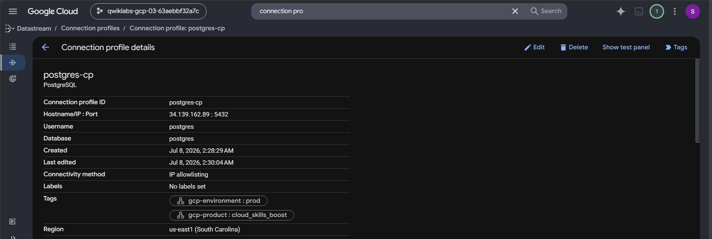
</p>

#### 2. BigQuery Destination Connection Profile
* Go to the **Connection Profiles** tab and click **Create Profile**.
* Select the **BigQuery** profile type.
* Set profile name: `bigquery-cp`.
* Select Region: `us-central1`.
* Click **Create**.

<p align="center">
  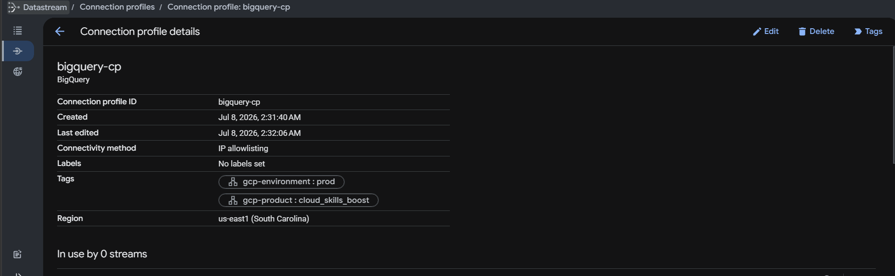
</p>

---

### Phase 6: Create and Start the Replication Stream

Assemble the connection profiles into a replication stream to initialize ingestion.

1. Navigate to **Streams** > **Create Stream**.
2. **Define Stream Details**:
   * Stream Name: `test-stream`
   * Region: `us-central1`
   * Source Type: `PostgreSQL`
   * Destination Type: `BigQuery`
3. **Define Source Profile**:
   * Select `postgres-cp`.
   * Click **Run Test** and then **Continue**.
4. **Configure Source details**:
   * Replication Slot Name: `test_replication`
   * Publication Name: `test_publication`
   * Schema: Select `test`.
5. **Define Destination Profile**:
   * Select `bigquery-cp` and click **Continue**.
6. **Configure Destination details**:
   * BigQuery Dataset Location: Select `us-central1`.
   * Staleness Limit: `0 seconds` (forces real-time synchronization).
7. **Review and Create**:
   * Click **Run Validation** to verify the configuration setup.
   * Once validated, click **Create & Start** to launch the replication stream.

<p align="center">
  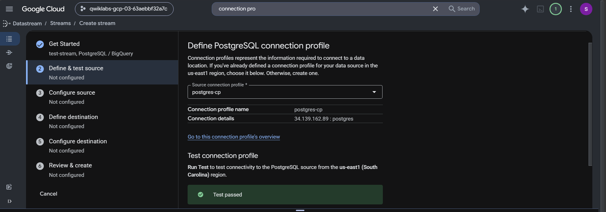
</p>

<p align="center">
  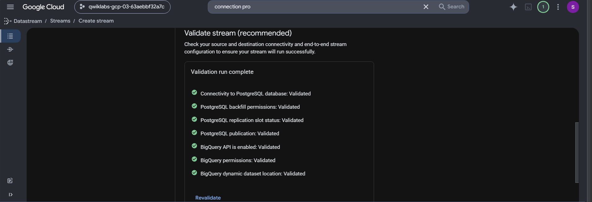
</p>

---

## Validation

### Step 1: Verify Initial Data in BigQuery

Verify that the base data from PostgreSQL has loaded successfully into BigQuery.

1. In the Google Cloud Console, navigate to **BigQuery** > **SQL Workspace**.
2. Expand the project tree, locate the `test` dataset, and choose the `example_table`.
3. Preview the contents or execute the following validation query:

```sql
# Query initial table contents in BigQuery
SELECT * FROM test.example_table ORDER BY id;
```

<p align="center">
  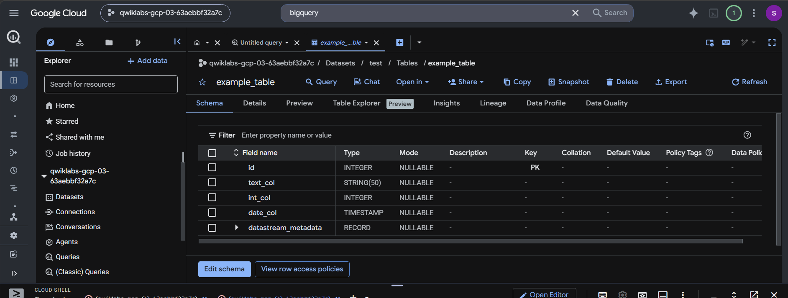
</p>

---

### Step 2: Validate Real-Time Change Data Capture (CDC)

Apply mutations (inserts, updates, and deletes) to the source PostgreSQL database and confirm they sync automatically to BigQuery.

1. Reconnect to the PostgreSQL database in Cloud Shell:

```bash
gcloud sql connect $POSTGRES_INSTANCE --user=postgres --project=$PROJECT_ID
```

2. Execute these mutation statements:

```sql
-- Insert new records
INSERT INTO test.example_table (text_col, int_col, date_col) VALUES
('abc', 0, '2022-10-01 00:00:00'),
('def', 1, NULL),
('ghi', -987, NOW());

-- Update existing records
UPDATE test.example_table SET int_col = int_col * 2; 

-- Delete a specific record
DELETE FROM test.example_table WHERE text_col = 'abc';
```

<p align="center">
  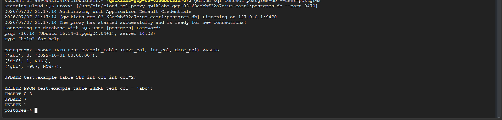
</p>

3. Wait a few seconds, then run the validation query again in BigQuery:

```sql
# Query table contents to verify replication of mutated data
SELECT * FROM test.example_table ORDER BY id;
```

<p align="center">
  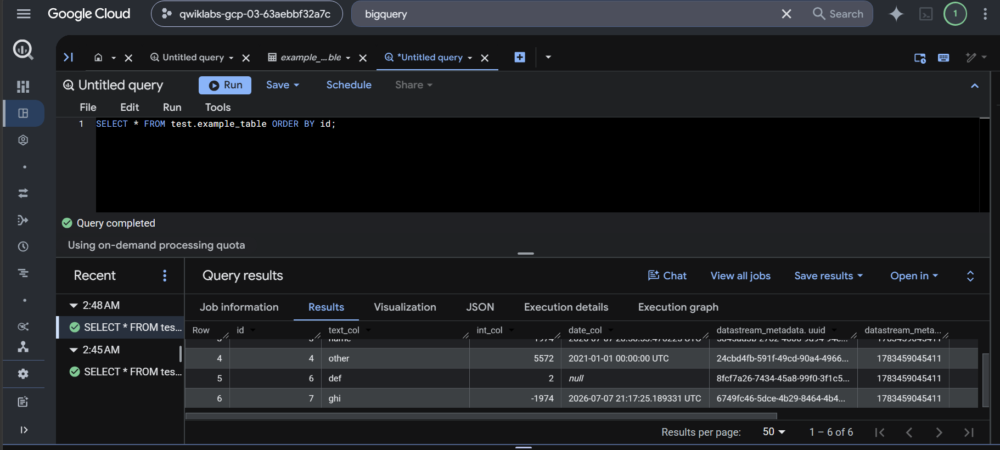
</p>

<p align="center">
  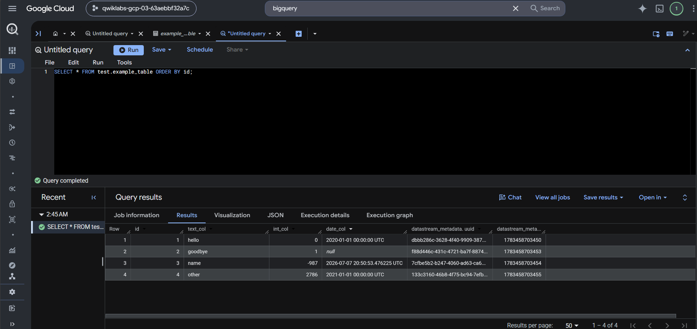
</p>

---

## Observability

To monitor the health and performance of the replication stream in production:
1. **Throughput and Latency Metrics:** Navigate to the Datastream **Stream Details** dashboard to view incoming write rate, read rate, and system throughput.
2. **Replication Delay:** Monitor the **System Latency** metric in Cloud Monitoring to ensure CDC latency remains under SLAs.
3. **Cloud Logging:** Query `resource.type="datastream.googleapis.com/Stream"` in Cloud Logging to audit configuration changes, schema drift notifications, and connection state transitions.

---

## Troubleshooting

### 1. Inactive Replication Slot
* **Symptom:** Stream status displays errors, or data replication stalls indefinitely.
* **Resolution:** Ensure that the replication slot created in PostgreSQL matches the configuration. Verify slot status inside PostgreSQL:
  ```sql
  SELECT slot_name, plugin, active FROM pg_replication_slots;
  ```
  If `active` is `false`, restart the Datastream stream to re-initialize the connection.

### 2. Network Block / Peer Connection Timed Out
* **Symptom:** The connection test fails when creating the PostgreSQL connection profile.
* **Resolution:** Double-check that the public IP of the Cloud SQL instance has been retrieved correctly. Confirm that the exact Datastream public IPs for your region have been added to the Cloud SQL **Authorized Networks** configuration list.

---

## Cleanup

> [!CAUTION]
> Tearing down resources deletes all database tables, replication logs, and BigQuery datasets permanently. Ensure all critical data is backed up before running these commands.

Execute the following commands in the Cloud Shell terminal to clean up and avoid recurring charges:

```bash
# Delete the Datastream stream (first stop the stream if running)
gcloud datastream streams delete test-stream \
    --location=$REGION \
    --project=$PROJECT_ID \
    --quiet

# Delete the connection profiles
gcloud datastream connection-profiles delete postgres-cp --location=$REGION --project=$PROJECT_ID --quiet
gcloud datastream connection-profiles delete bigquery-cp --location=$REGION --project=$PROJECT_ID --quiet

# Remove the Cloud SQL PostgreSQL database instance
gcloud sql instances delete $POSTGRES_INSTANCE --project=$PROJECT_ID --quiet

# Remove the BigQuery target dataset (including all tables)
bq rm -r -f -d test
```
